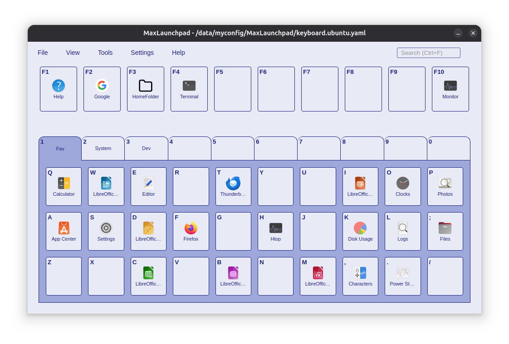

# MaxLaunchpad — Lanceur d'applications multiplateforme piloté au clavier

> Invoquez un clavier virtuel avec une touche de raccourci, puis appuyez sur une touche pour lancer l'application. Pas de saisie, pas de recherche, pas de loterie du classement approximatif.

[English](../../README.md) · [简体中文](README.zh-CN.md) · [繁體中文](README.zh-TW.md) · **[Français](README.fr.md) (cette page)** · [Deutsch](README.de.md) · [日本語](README.ja.md) · [Русский](README.ru.md) · [Español](README.es.md) · [한국어](README.ko.md)

[](https://github.com/AwesomeDog/maxlaunchpad/releases)
[](https://github.com/AwesomeDog/maxlaunchpad/releases)
[](https://github.com/AwesomeDog/maxlaunchpad/releases)
[](../../LICENSE)

<p align="center">
  
</p>

MaxLaunchpad est un lanceur d'applications gratuit et open source pour Windows, macOS et Linux. Il associe vos applications aux touches d'un clavier virtuel, que l'on invoque depuis n'importe quelle application avec un raccourci global, puis une seule touche suffit pour lancer le programme visé.

## Aperçu des fonctionnalités

- **Lancement déterministe** — la même touche lance toujours la même application, indépendamment du classement de recherche.
- **310 raccourcis** — 10 onglets de 30 touches, plus les touches `F1`–`F10` partagées entre les onglets.
- **Raccourci global** — `Alt` + `` ` `` sur Windows/Linux et `Option` + `` ` `` sur macOS par défaut, entièrement personnalisable.
- **Lancement multiplateforme** — exécutables, raccourcis, scripts, bundles d'applications, entrées `.desktop`, URL, ainsi que les arguments et le répertoire de travail.
- **Configuration par glisser-déposer** — faites glisser un programme depuis l'Explorateur, le Finder ou votre gestionnaire de fichiers sur une touche.
- **Profils multiples** — gérez vos contextes avec `keyboard.yaml`, `work.yaml`, `gaming.yaml` et d'autres fichiers YAML.
- **Recherche et sélection rapide** — cherchez parmi les applications installées dans la boîte de dialogue d'édition pour remplir automatiquement le nom, le chemin et la description.
- **Thèmes et interface** — thèmes clair, sombre et système, CSS personnalisé, mode compact, fenêtre toujours au premier plan et masquage automatique à la perte du focus.
- **Barre système** — réduction dans la barre système, lancement au démarrage et démarrage masqué.
- **Gratuit et open source** — basé sur Electron, React et TypeScript : pas de compte, pas de cloud, pas de télémétrie.

## Installation

### Gestionnaires de paquets

```shell
# Windows
winget install AwesomeDog.MaxLaunchpad

# macOS
brew install --cask AwesomeDog/tap/maxlaunchpad
```

### Téléchargement direct

Récupérez le programme d'installation de votre système sur la [page des versions](https://github.com/AwesomeDog/maxlaunchpad/releases).

| Plateforme | Prérequis | Remarques |
| --- | --- | --- |
| Windows | Windows 10 ou ultérieur | Fonctionne immédiatement après l'installation. |
| macOS | macOS 11 Big Sur ou ultérieur (Apple Silicon) | Exécutez `xattr -cr /Applications/MaxLaunchpad.app` pour lever la quarantaine. |
| Linux | Ubuntu 24.04 ou distribution équivalente | Sous Wayland, le raccourci global peut nécessiter une configuration manuelle dans les paramètres clavier de GNOME. |

## Démarrage en 60 secondes

1. **Lancez MaxLaunchpad.** Le clavier virtuel s'affiche ; l'application se trouve aussi dans la barre système.
2. **Activez `View > Drag & Drop Mode`** pour que la fenêtre reste visible pendant la configuration.
3. **Faites glisser des applications sur les touches** depuis l'Explorateur / le Finder / Fichiers — ou faites un clic droit sur une touche → **Edit** et utilisez **Quick Select** pour chercher une application installée.
4. **Nommez vos onglets** (clic droit sur une touche numérique `1`–`0` → Edit) : par exemple `Dev`, `Work`, `Games`.
5. **Désactivez le mode glisser-déposer**, appuyez sur `Alt` + `` ` `` n'importe où, puis sur la touche voulue. C'est terminé.

Toutes les données utilisateur sont stockées par défaut dans :

```text
~/.config/MaxLaunchpad/
├── settings.yaml     # Paramètres de l'application et raccourci global
├── keyboard.yaml     # Profil de clavier par défaut
├── caches/           # Cache des icônes
├── logs/             # Journaux de l'application
├── styles/           # Thèmes CSS personnalisés
└── backups/          # Sauvegardes automatiques
```

Si `XDG_CONFIG_HOME` est défini, ces chemins sont ajustés en conséquence. Placez ce dossier dans Git, Dropbox ou Syncthing pour synchroniser votre configuration entre plusieurs machines.

## Disposition du clavier et raccourcis

```text
F1 F2 F3 F4 F5 F6 F7 F8 F9 F10   Raccourcis partagés entre tous les onglets
1  2  3  4  5  6  7  8  9  0     Bascule entre les onglets
Q  W  E  R  T  Y  U  I  O  P
A  S  D  F  G  H  J  K  L  ;     30 touches d'application par onglet
Z  X  C  V  B  N  M  ,  .  /
```

| Raccourci | Action |
| --- | --- |
| `Alt` + `` ` `` (`Option` + `` ` `` sur macOS) | Afficher / masquer MaxLaunchpad |
| `F1`–`F10` | Lancer un raccourci global |
| `Q`–`P`, `A`–`;`, `Z`–`/` | Lancer l'application de l'onglet actif |
| `1`–`0` | Aller à l'onglet correspondant |
| `←` / `→` | Onglet précédent / suivant |
| `Ctrl+F` / `Cmd+F` | Rechercher parmi tous les raccourcis |
| `Échap` | Fermer la boîte de dialogue ou masquer la fenêtre |
| Clic gauche sur une touche | Lancer le programme |
| Clic droit sur une touche | Menu contextuel (Édition / Copier / Couper / Coller / Supprimer / Ouvrir l'emplacement) |
| Déposer un fichier sur une touche | Configurer cette touche |

## Exemple de configuration YAML

```yaml
tabs:
  - id: '1'
    label: 'Dev'
  - id: '2'
    label: 'Work'

keys:
  - tabId: '1'
    id: Q
    label: Terminal
    filePath: '/Applications/Terminal.app'

  - tabId: '1'
    id: C
    label: Chrome
    filePath: 'https://www.google.com'
```

Chaque raccourci accepte également les champs `arguments`, `workingDirectory`, `runAsAdmin`, `description` et une icône personnalisée. Voir l'exemple complet : [`docs/examples/full-featured.yaml`](../examples/full-featured.yaml).

## Questions fréquentes

**MaxLaunchpad est-il gratuit ?**  Oui. Le projet est publié sous licence MIT : gratuit et open source.

**Prend-il en charge Windows 11 et Apple Silicon ?**  Oui. Windows 11 entre dans le champ « Windows 10+ », et le programme d'installation macOS vise Apple Silicon.

**Le raccourci global fonctionne-t-il sur Linux / Wayland ?**  Oui, mais certains environnements de bureau exigent de lier le raccourci manuellement dans les paramètres clavier du système.

**Peut-il lancer des applications du Microsoft Store, des raccourcis `.lnk` et des scripts ?**  Oui. Windows : `.exe`, `.lnk`, `.bat`, `.cmd`, `.ps1`, UWP et `shell:` ; macOS : `.app`, exécutables Unix, `.sh`, `.command` ; Linux : ELF, `.desktop`, `.sh`, `.py` et `.rb`.

**Où se trouvent les journaux et les sauvegardes ?**  Dans `~/.config/MaxLaunchpad/logs/` et `~/.config/MaxLaunchpad/backups/`.

## Documentation et développement

- [Manuel en ligne](https://awesomedog.github.io/maxlaunchpad/)
- [FAQ](../faq/index.md)
- [Guide utilisateur](../guide/index.md)
- [Architecture technique](../tech/technical-architecture.md)
- [Internationalisation](../tech/i18n.md)

L'environnement de développement requiert Node.js `>=22.20.0` :

```shell
npm install
npm start       # Lancer en mode développement
npm test        # Exécuter les tests
npm run lint    # Exécuter ESLint
npm run make    # Construire le programme d'installation
```

La structure du projet, le processus de contribution et tous les scripts sont décrits dans le [guide de développement](../../README.md#development-guide-for-contributors) du README anglais. Les signalements de bugs et les pull requests sont bienvenus.

## Licence et remerciements

MaxLaunchpad est publié sous licence MIT. Il est le successeur spirituel de [MaxLauncher](https://maxlauncher.sourceforge.io/), aujourd'hui abandonné, et étend son flux de lancement au clavier de Windows vers macOS et Ubuntu/Linux.
