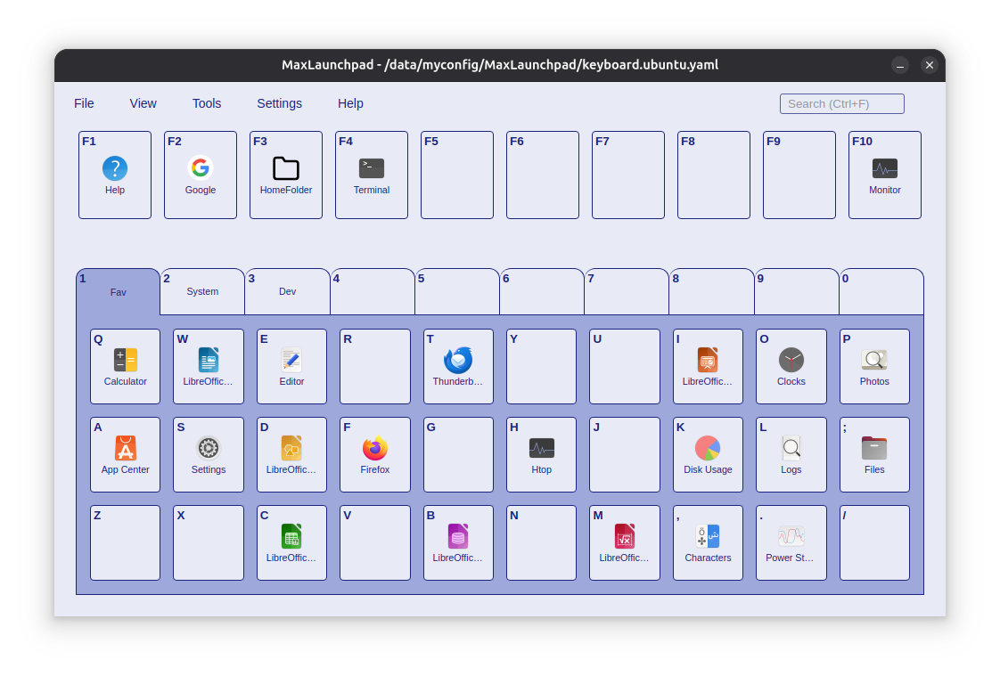

# MaxLaunchpad

**Launch apps with muscle memory, not mental effort**



## What is MaxLaunchpad?

How many clicks does it take to launch your favorite app? Start Menu, scroll, click... or worse, type the name and hope
autocomplete gets it right. Repeat hundreds of times a day.

MaxLaunchpad reduces this to **two keystrokes**: one to summon the launcher, one to launch your app. That's the whole
interface.

## Installation

Via Package Manager

```shell
# on Windows
winget install AwesomeDog.MaxLaunchpad
# on macOS
brew install --cask AwesomeDog/tap/maxlaunchpad
```

Or

Download the installer from [Releases](https://github.com/AwesomeDog/maxlaunchpad/releases).

- **Windows** — Windows 10 or later. Works out of the box.
- **macOS** — macOS 11 (Big Sur) or later (Apple Silicon).
    - Run `xattr -cr /Applications/MaxLaunchpad.app` to remove quarantine.
    - You may need to manually add the app
      to [Login Items](https://support.apple.com/guide/mac-help/change-login-items-extensions-settings-mtusr003/mac) for
      auto-start.
- **Linux** — Ubuntu 24.04 or equivalent (Wayland).
    - Global hotkey may
      require [manual setup](https://help.ubuntu.com/stable/ubuntu-help/keyboard-shortcuts-set.html.en).

## Quick Start

### How to Use

1. Press `Alt` + `` ` `` to open MaxLaunchpad (`Option` + `` ` `` on macOS)
2. Press any configured key to launch the app
3. The window auto-hides after launch

### How to Configure

- **Drag & Drop**: Enable `View > Drag & Drop Mode`, then drag executables onto keys
- **Right-click**: Edit label, path, arguments, working directory, and icon. Or autofill with "Quick Select"

## Key Features

**Instant Launch — No Typing, No Searching, No Waiting**

- **Single keystroke launch** — Press a letter key to launch instantly
- **Zero typing** — No search box, no autocomplete, just press and go
- **Muscle memory driven** — Same key = same app, every time
- **Global hotkey** — Summon from anywhere with `Alt` + `` ` ``
- **Toggle visibility** — Same hotkey shows and hides the window
- **Case-insensitive** — Press `q` or `Q`, same result
- **Click or keyboard** — Launch with mouse click or keystroke, your choice

**Effortless Setup — Drag, Drop, Done**

- **Drag & Drop Mode** — Keeps window visible while dragging from file manager
- **Drag & drop setup** — Drag executables onto keys, done
- **Quick Select** — Search installed apps and autofill key settings
- **Smart shortcut parsing** — Windows `.lnk` files auto-extract target, arguments, and working directory
- **Right-click to edit** — Full control over label, path, arguments, working directory, and icon
- **Copy/Cut/Paste keys** — Rearrange shortcuts across tabs effortlessly
- **Auto-save** — Changes saved automatically, no manual save needed
- **Auto-backup** — Profile backups created on every change, safely in `~/.config/MaxLaunchpad/backups/`

**Your Data, Your Way — Portable Profiles**

- **Switch contexts instantly** — `work.yaml`, `gaming.yaml`, `dev.yaml`
- **Portable configs** — YAML files you can sync, backup, or share
- **New/Open/Save As** — Full profile file management
- **Human-readable YAML** — Edit configs by hand if you prefer, see [examples](./examples/)

**Massive Capacity — 310 Shortcuts, Neatly Organized**

- **310 shortcuts** — 10 tabs × 30 keys + 10 global function keys
- **10 tabs for categorization** — Organize by project, workflow, or context
- **Global function keys (F1–F10)** — Always accessible, shared across all tabs
- **Custom tab labels** — Name tabs to match your workflow
- **Visual keyboard layout** — Familiar QWERTY arrangement, easy to remember

**Stays Out of Your Way — Smart Window Behavior**

- **Always on top** — Never buried under other windows when summoned
- **Auto-hide on blur** — Disappears when you click away
- **Lock window center** — Pin to screen center, no accidental dragging
- **System tray integration** — Lives quietly until needed
- **Start minimized** — Launch on startup without interruption
- **Close to tray** — X button minimizes, doesn't quit
- **Single instance** — Second launch brings existing window to front
- **Remember last tab** — Opens to the tab you used last, or a fixed tab of your choice
- **Works across multiple displays & workspaces** — Shows exactly where you need it

**Works Everywhere — True Cross-Platform**

- **Windows, macOS, Ubuntu** — Native look and feel on each platform
- **Launch anything** — `.exe`, `.app`, `.desktop`, scripts, URLs, Store apps
- **Run as admin** — Windows elevation support built-in
- **Windows Store apps** — Launch UWP/Store apps via `shell:appsFolder`
- **Scripts supported** — `.bat`, `.cmd`, `.ps1`, `.sh`, `.py`, `.rb`
- **URLs supported** — Open websites in default browser
- **Quick access to app folders** — Tools menu opens Start Menu / Applications folder
- **Easy Workflow** — `npm start` / `npm run build` by one stroke

**Quick Search & Navigation**

- **Quick search** — `Ctrl+F` / `Cmd+F` to filter keys across all tabs
- **Real-time filtering** — Results update as you type
- **Keyboard navigation** — Arrow keys and scroll wheel to switch tabs
- **Number keys switch tabs** — Press `1`–`0` to jump directly
- **Open app locations** — Jump to file location from context menu
- **Esc to dismiss** — Quick hide with Escape key

**Make It Yours — Full Customization**

- **Customizable hotkey** — Change modifier keys and trigger key to your preference
- **Light/Dark/System theme** — Follows your OS preference or override manually
- **Custom CSS styles** — Full visual customization via CSS files
- **Custom icons** — Set any image as shortcut icon
- **Auto-generated icons** — Fallback avatars when no icon is available
- **Command-line arguments** — Pass arguments to launched programs
- **Working directory** — Set where the program starts
- **Tooltips** — Add descriptions shown on hover

## Need Help?

Check the [FAQ](./faq/) for answers to common questions and troubleshooting tips.
